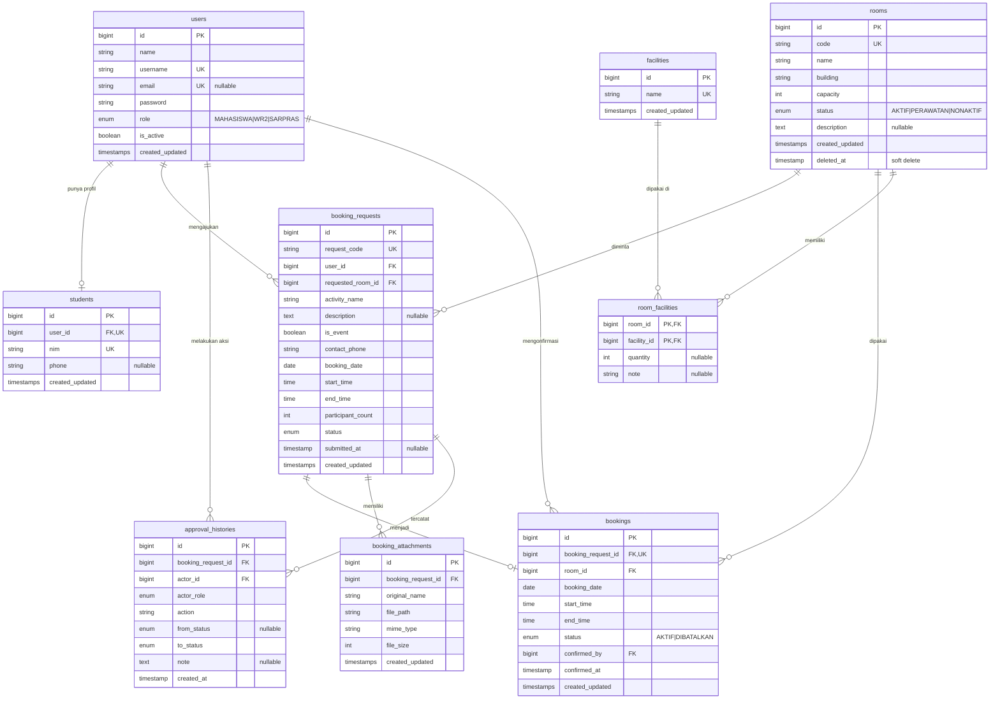

# Rancangan Awal — Sistem Peminjaman & Pengelolaan Ruangan ITB STIKOM Bali

> Status: **DRAFT rancangan, belum ada kode.** Menunggu persetujuan sebelum implementasi.
> Legenda: **[FACT]** = hasil observasi dari brief · **[ASSUMPTION]** = asumsi saya, belum dikonfirmasi · **[NEED CLARIFICATION]** = harus dikonfirmasi sebelum diputuskan.

---

## 0. Analisis Requirement & Potensi Masalah (STEP 1)

### 0.1 Potensi masalah yang ditemukan

| # | Masalah | Dampak | Usulan penanganan |
|---|---------|--------|-------------------|
| P1 | **Race condition**: dua petugas/proses mengonfirmasi ruangan & waktu yang sama bersamaan | Double booking walau ada validasi | Cek bentrok di dalam DB transaction + `SELECT ... FOR UPDATE` pada baris ruangan saat konfirmasi |
| P2 | WR 2 menyetujui **sebelum** ruangan dipastikan tersedia, sehingga Sarpras bisa menolak setelah WR 2 setuju | Peminjam bingung, proses sia-sia | Tampilkan ketersediaan saat membuat pengajuan (sudah ada di brief) + peringatan bentrok untuk WR 2 (hanya informasi) |
| P3 | Pengajuan yang statusnya belum `DIKONFIRMASI` apakah ikut memblokir ruangan? | Menentukan definisi "peminjaman aktif" | Lihat C3 |
| P4 | Brief hanya menyebut satu tanggal | Event multi-hari tidak tertampung | Lihat C5 |
| P5 | Sarpras boleh "menyesuaikan" ruangan/waktu | Hasil akhir bisa berbeda dari yang diminta, perlu jejak | Pisahkan data **permintaan** (`booking_requests`) dan **jadwal final** (`bookings`) |
| P6 | Perubahan status sembarangan lewat manipulasi request | Pelanggaran alur bisnis | State machine di server + policy per role (bukan hanya sembunyikan tombol di UI) |
| P7 | Akses lampiran lewat URL langsung | Surat bisa dibuka orang lain | Simpan di storage privat, unduh lewat route yang dicek otorisasinya |
| P8 | Zona waktu | Jadwal bergeser | Set `Asia/Makassar` (WITA) di aplikasi |
| P9 | Transisi dari papan manual | Data lama/booking langsung (walk-in) tidak tercatat | Lihat C12 |

### 0.2 FACT dari observasi (dari brief)

1. Peminjaman melibatkan **WR 2** (memberi izin).
2. Setelah izin, proses dilanjutkan ke **Sarpras**.
3. Ketersediaan ruangan dicek oleh **Sarpras** berdasarkan tanggal/waktu.
4. Jika bentrok, peminjam memilih ruangan/waktu lain.
5. Pencatatan saat ini manual di **papan**; belum ada form terintegrasi.
6. Data yang biasa diberikan: nama, NIM, nomor HP, keperluan, tanggal, waktu, ruangan.
7. Event tertentu memerlukan **surat pengajuan**.

### 0.3 NEED CLARIFICATION (beserta usulan default)

Jika tidak dijawab, saya akan memakai **usulan default** dan menandainya sebagai ASSUMPTION di dokumentasi.

| ID | Pertanyaan | Usulan default (ASSUMPTION) |
|----|-----------|------------------------------|
| C1 | **Tech stack** belum ditentukan di brief | Laravel (PHP) + MySQL + Blade + Tailwind CSS + Alpine.js |
| C2 | Apakah peminjam hanya mahasiswa? Bagaimana dengan UKM/ormawa, dosen, staf? | Hanya role Mahasiswa; satu akun = satu mahasiswa |
| C3 | Status apa yang **memblokir** ruangan? | Hanya booking berstatus `DIKONFIRMASI` (aktif). Pengajuan yang belum dikonfirmasi tidak memblokir, tapi Sarpras diberi peringatan jika ada pengajuan lain yang tumpang tindih |
| C4 | Aturan batas waktu: boleh mulai tepat saat sebelumnya selesai? | Ya (interval `[mulai, selesai)`); tidak ada buffer antar peminjaman |
| C5 | Apakah ada event **multi-hari**? | Tidak; 1 pengajuan = 1 tanggal. Event multi-hari diajukan terpisah per hari |
| C6 | Kapan surat **wajib**? Kriteria "event tertentu" apa? | Ada checkbox "Kegiatan/event" di form; jika dicentang, upload surat wajib |
| C7 | Boleh dibatalkan sampai tahap mana, dan oleh siapa? | Mahasiswa: boleh sampai `DIPROSES_SARPRAS`. Setelah `DIKONFIRMASI`, hanya Sarpras yang boleh membatalkan |
| C8 | Jika Sarpras menolak/tidak ada alternatif, apa yang terjadi? | `DITOLAK_SARPRAS` dengan alasan; mahasiswa mengajukan ulang (baru, lewat WR 2 lagi). **Perlu dikonfirmasi apakah ulang lewat WR 2 atau tidak** |
| C9 | Jika Sarpras **mengubah ruangan/waktu**, apakah perlu persetujuan mahasiswa/WR 2 lagi? | Tidak perlu persetujuan ulang; mahasiswa diberi tahu lewat status & catatan (ruangan/waktu final tampil di detail) |
| C10 | Aturan operasional: jam buka ruangan, durasi min/maks, batas hari pengajuan di muka (mis. H-3) | Belum ada validasi selain: tanggal tidak boleh lampau, selesai > mulai |
| C11 | Jumlah peserta > kapasitas ruangan: blokir atau peringatan? | Peringatan di form + Sarpras bisa menolak/menyesuaikan (tidak diblokir keras) |
| C12 | Apakah Sarpras perlu **input manual** peminjaman langsung (walk-in) dan impor data dari papan? | Tidak ada di MVP (di luar brief). Jika perlu, jadi fitur tambahan |
| C13 | Pembuatan akun: mahasiswa daftar sendiri, atau diimpor/dibuatkan admin? Siapa yang mengelola akun WR 2 & Sarpras? | Mahasiswa dibuat lewat seeder/impor; akun WR 2 & Sarpras di-seed; tidak ada fitur kelola user di MVP |
| C14 | Notifikasi? Brief hanya menyebut melihat status tanpa datang ke Sarpras | Hanya status di dashboard (tanpa email/WA) |
| C15 | Bagaimana status `SELESAI` ditetapkan? | Otomatis oleh scheduled command setelah waktu selesai terlewat |
| C16 | Format & ukuran lampiran | PDF/JPG/PNG, maks 2 MB per file, maks 3 file |
| C17 | Satu atau banyak akun WR 2 / Sarpras? | Mendukung banyak akun per role; siapa pun dengan role tersebut dapat memproses |

---

## 1. Ringkasan Requirement

Sistem web untuk mendigitalisasi proses peminjaman ruangan ITB STIKOM Bali tanpa mengubah struktur kewenangan: **Mahasiswa mengajukan → WR 2 menyetujui/menolak → Sarpras mengecek ketersediaan dan mengonfirmasi → jadwal tersimpan terpusat**. Sistem harus mencegah bentrok jadwal berdasarkan ruangan + tanggal + rentang waktu + status, menyediakan kalender ketersediaan, dashboard per role, serta keamanan dasar (autentikasi, otorisasi per role, validasi server-side, proteksi data milik user lain). Data awal berupa **data dummy**. Fitur di luar peminjaman dan pengelolaan ruangan (payment, denda, QR, IoT, AI, WhatsApp, Google Calendar, SIAKAD, absensi, KRS, nilai) **tidak dibuat**.

---

## 2. Aktor & Hak Akses

| Fitur | Mahasiswa | WR 2 | Sarpras |
|-------|:---------:|:----:|:-------:|
| Login/logout | ✅ | ✅ | ✅ |
| Dashboard (sesuai role) | ✅ | ✅ | ✅ |
| Lihat daftar ruangan, kapasitas, fasilitas | ✅ | — | ✅ |
| Lihat kalender/ketersediaan ruangan | ✅ | ✅ (info bentrok) | ✅ |
| Buat/ubah draft/submit/batalkan pengajuan sendiri | ✅ | — | — |
| Lihat pengajuan | Milik sendiri | Yang masuk tahap WR 2 + riwayat yang diproses | Yang sudah `DISETUJUI_WR2` ke atas |
| Setuju / tolak (dengan alasan) | — | ✅ | — |
| Proses, konfirmasi, tolak, sesuaikan ruangan/waktu | — | — | ✅ |
| CRUD ruangan, kapasitas, fasilitas | — | — | ✅ |
| Lihat riwayat | Milik sendiri | Yang diproses WR 2 | Semua yang melalui Sarpras |

Aturan akses utama:
- Mahasiswa hanya boleh membuka pengajuan **miliknya** (cek kepemilikan di server, bukan hanya di UI).
- WR 2 hanya dapat memproses pengajuan berstatus `MENUNGGU_PERSETUJUAN_WR2`.
- Pengajuan `DITOLAK_WR2` **tidak** muncul/diteruskan ke Sarpras.

---

## 3. Use Case

**Mahasiswa**
- UC-01 Login
- UC-02 Melihat daftar ruangan & detail (kapasitas, fasilitas)
- UC-03 Melihat ketersediaan/kalender ruangan
- UC-04 Membuat pengajuan (draft → submit)
- UC-05 Upload surat/lampiran
- UC-06 Melihat status & detail pengajuan
- UC-07 Melihat riwayat peminjaman
- UC-08 Membatalkan pengajuan

**WR 2**
- UC-09 Melihat daftar & detail pengajuan (termasuk lampiran)
- UC-10 Menyetujui pengajuan
- UC-11 Menolak pengajuan + alasan
- UC-12 Melihat riwayat pengajuan yang telah diproses

**Sarpras**
- UC-13 Melihat pengajuan yang disetujui WR 2
- UC-14 Mengecek ketersediaan ruangan (deteksi bentrok)
- UC-15 Mengonfirmasi peminjaman (menetapkan ruangan & jadwal)
- UC-16 Menolak/menyesuaikan peminjaman bila tidak tersedia
- UC-17 Mengelola data ruangan, kapasitas, fasilitas
- UC-18 Melihat kalender & riwayat peminjaman

**Sistem**
- UC-19 Mendeteksi bentrok jadwal
- UC-20 Mencatat riwayat persetujuan/perubahan status
- UC-21 Menandai booking `SELESAI` otomatis (ASSUMPTION C15)

---

## 4. Alur Bisnis AS-IS **[FACT]**

```text
Peminjam ingin memakai ruangan
        ↓
Mengajukan izin ke WR 2 (+ surat bila event tertentu)
        ↓
Izin WR 2 didapat → peminjam datang ke Sarpras
        ↓
Sarpras mengecek ketersediaan (tanggal/waktu) lewat papan
        ↓
   ┌───────────┴───────────┐
 Bentrok               Tersedia
   ↓                       ↓
Peminjam pilih      Petugas mencatat di papan
ruangan/waktu lain  (nama, NIM, HP, kegiatan, tanggal, waktu, ruangan)
```

Kelemahan: pencatatan manual, tidak ada form terintegrasi, peminjam harus datang untuk tahu status, risiko bentrok karena data terpusat hanya di papan.

---

## 5. Alur Bisnis TO-BE

```text
Mahasiswa: login → lihat ketersediaan → buat pengajuan → submit
        ↓  (MENUNGGU_PERSETUJUAN_WR2)
WR 2: periksa pengajuan & surat
   ┌────┴────┐
 Tolak     Setuju
   ↓          ↓
DITOLAK_WR2  DISETUJUI_WR2
(selesai)       ↓
            Sarpras: proses (DIPROSES_SARPRAS) → cek ketersediaan
                ┌────┴────┐
          Tidak tersedia  Tersedia
                ↓            ↓
        Cari alternatif   Konfirmasi (transaksi + cek bentrok)
        atau tolak           ↓
        (DITOLAK_SARPRAS) DIKONFIRMASI → booking tercatat di jadwal
                              ↓
                  Status terlihat oleh Mahasiswa
                              ↓
                  Waktu lewat → SELESAI
```

### State machine status pengajuan

| Dari | Ke | Aktor | Syarat |
|------|----|-------|--------|
| (baru) | `DRAFT` | Mahasiswa | — |
| `DRAFT` | `MENUNGGU_PERSETUJUAN_WR2` | Mahasiswa | Data lengkap & valid, surat jika wajib |
| `DRAFT` | `DIBATALKAN` | Mahasiswa | — |
| `MENUNGGU_PERSETUJUAN_WR2` | `DISETUJUI_WR2` | WR 2 | — |
| `MENUNGGU_PERSETUJUAN_WR2` | `DITOLAK_WR2` | WR 2 | Alasan wajib |
| `MENUNGGU_PERSETUJUAN_WR2` | `DIBATALKAN` | Mahasiswa | Pemilik |
| `DISETUJUI_WR2` | `DIPROSES_SARPRAS` | Sarpras | Tombol "Proses" |
| `DISETUJUI_WR2` | `DIBATALKAN` | Mahasiswa | ASSUMPTION C7 |
| `DIPROSES_SARPRAS` | `DIKONFIRMASI` | Sarpras | Tidak bentrok, ruangan aktif |
| `DIPROSES_SARPRAS` | `DITOLAK_SARPRAS` | Sarpras | Alasan wajib |
| `DIPROSES_SARPRAS` | `DIBATALKAN` | Mahasiswa | ASSUMPTION C7 |
| `DIKONFIRMASI` | `SELESAI` | Sistem | Waktu selesai terlewat (C15) |
| `DIKONFIRMASI` | `DIBATALKAN` | Sarpras | ASSUMPTION C7; booking dilepas dari jadwal |

Status terminal: `DITOLAK_WR2`, `DITOLAK_SARPRAS`, `SELESAI`, `DIBATALKAN`. Transisi di luar tabel ditolak server.

### Aturan bentrok jadwal

Interval waktu diperlakukan **setengah-terbuka `[mulai, selesai)`**. Dua booking bentrok jika:

```text
ruangan sama
AND tanggal sama
AND status booking = aktif (DIKONFIRMASI)
AND mulai_baru < selesai_lama
AND selesai_baru > mulai_lama
```

Contoh (Ruang 301, 10 Oktober):

| Booking | Waktu | Hasil |
|---------|-------|-------|
| A (sudah aktif) | 08:00–10:00 | — |
| B | 09:00–11:00 | **Bentrok** (09:00 < 10:00 dan 11:00 > 08:00) |
| C | 10:00–12:00 | **Tidak bentrok** (10:00 < 10:00 salah) |

Validasi dijalankan di **server** pada: (a) tampilan peringatan saat submit, (b) konfirmasi Sarpras — yang wajib dalam transaksi dengan kunci baris untuk mencegah race condition, mengecualikan booking itu sendiri saat edit.

---

## 6. Kebutuhan Fungsional

| ID | Kebutuhan |
|----|-----------|
| FR-01 | Sistem menyediakan login dan logout untuk 3 role |
| FR-02 | Akses halaman dan aksi dibatasi berdasarkan role |
| FR-03 | Mahasiswa melihat daftar ruangan, kapasitas, fasilitas |
| FR-04 | Mahasiswa dan Sarpras melihat jadwal/ketersediaan ruangan per tanggal |
| FR-05 | Mahasiswa membuat pengajuan dengan data: nama (dari akun), NIM (dari akun), nomor HP, kegiatan, tanggal, waktu mulai/selesai, jumlah peserta, ruangan diinginkan, keterangan, lampiran |
| FR-06 | Pengajuan dapat disimpan sebagai draft, lalu disubmit |
| FR-07 | Mahasiswa mengunggah surat; wajib bila kegiatan bertipe event |
| FR-08 | Mahasiswa melihat status, detail, dan riwayat pengajuan miliknya |
| FR-09 | Mahasiswa dapat membatalkan pengajuan sesuai aturan status |
| FR-10 | WR 2 melihat daftar & detail pengajuan beserta lampiran |
| FR-11 | WR 2 menyetujui atau menolak (alasan wajib saat menolak) |
| FR-12 | Pengajuan `DITOLAK_WR2` tidak tampil di antrean Sarpras |
| FR-13 | Sarpras melihat pengajuan `DISETUJUI_WR2` dan yang sedang diproses |
| FR-14 | Sarpras mengecek ketersediaan dan melihat bentrok |
| FR-15 | Sarpras mengonfirmasi dengan menetapkan ruangan, tanggal, waktu final |
| FR-16 | Sarpras menolak (alasan wajib) atau menyesuaikan ruangan/waktu bila tidak tersedia |
| FR-17 | Sistem mencegah bentrok berdasarkan ruangan, tanggal, waktu mulai/selesai, status |
| FR-18 | Sarpras CRUD ruangan (kode, nama, gedung, kapasitas, status, keterangan) |
| FR-19 | Sarpras mengelola fasilitas ruangan (master fasilitas + relasi ke ruangan) |
| FR-20 | Setiap perubahan status tercatat di riwayat (siapa, kapan, dari/ke status, catatan) |
| FR-21 | Kalender ruangan menampilkan blok Digunakan/Tersedia per ruangan |
| FR-22 | Dashboard per role sesuai bagian 9 brief |
| FR-23 | Tabel dengan pencarian dan filter |
| FR-24 | Modal konfirmasi untuk aksi penting (setuju, tolak, konfirmasi, batalkan, hapus) |
| FR-25 | Data dummy awal via seeder, dapat diubah lewat fitur Sarpras/DB |

## 7. Kebutuhan Nonfungsional

| ID | Kategori | Kebutuhan |
|----|----------|-----------|
| NFR-01 | Keamanan | Password di-hash (bcrypt/argon2); proteksi CSRF; session aman |
| NFR-02 | Keamanan | Otorisasi di server (middleware role + policy kepemilikan); cegah IDOR |
| NFR-03 | Keamanan | Validasi input server-side (Form Request) |
| NFR-04 | Keamanan | Validasi upload: ekstensi, MIME asli, ukuran; nama file diacak; simpan di storage privat |
| NFR-05 | Integritas data | Foreign key, unique constraint, transaksi pada konfirmasi |
| NFR-06 | Konsistensi | Status memakai satu sumber (Enum) |
| NFR-07 | Usability | Responsif desktop/mobile; sidebar untuk Sarpras/WR 2; badge status |
| NFR-08 | Usability | Empty, loading, error state; notifikasi sukses |
| NFR-09 | Performa | Daftar dipaginasi; indeks pada `(room_id, booking_date, start_time, end_time)` |
| NFR-10 | Audit | Riwayat approval tidak dapat diubah/dihapus lewat UI |
| NFR-11 | Maintainability | Logika bisnis di service class, bukan di controller/view |
| NFR-12 | Lokalisasi | Bahasa Indonesia; zona waktu `Asia/Makassar` |
| NFR-13 | Testability | Feature test untuk state machine, otorisasi, dan bentrok |

---

## 8. ERD / Database Schema

### 8.1 Diagram (Mermaid)



### 8.2 Penjelasan relasi

| Relasi | Kardinalitas | Penjelasan |
|--------|--------------|------------|
| `users` — `students` | 1 : 0..1 | Data akademik (NIM) dipisah dari akun login. Hanya user role Mahasiswa yang punya baris `students`. |
| `users` — `booking_requests` | 1 : N | Satu mahasiswa banyak pengajuan; kepemilikan dicek lewat `user_id`. |
| `rooms` — `booking_requests` | 1 : N | Ruangan yang **diinginkan** peminjam (`requested_room_id`). |
| `booking_requests` — `bookings` | 1 : 0..1 | Booking final dibuat hanya saat `DIKONFIRMASI`. Pisahnya data permintaan dan jadwal final menjaga jejak bila Sarpras menyesuaikan ruangan/waktu (`bookings.room_id` bisa berbeda dari `requested_room_id`). |
| `rooms` — `bookings` | 1 : N | Ruangan yang **benar-benar** dipakai; tabel inilah dasar deteksi bentrok. |
| `rooms` — `facilities` | N : M | Lewat `room_facilities` (pivot, dengan `quantity` dan `note` opsional). Master fasilitas (AC, Proyektor, dst.) tidak diduplikasi per ruangan. |
| `booking_requests` — `booking_attachments` | 1 : N | Satu pengajuan boleh punya beberapa lampiran. |
| `booking_requests` — `approval_histories` | 1 : N | Log semua perubahan status (append-only). Alasan penolakan disimpan di `note`, sehingga tidak ada kolom alasan ganda di tabel utama. |

### 8.3 Keputusan desain & kendala

- **Nama dan NIM tidak disalin** ke `booking_requests`; diambil dari `users`/`students` (menghindari duplikasi). `contact_phone` disimpan per pengajuan karena berupa data pengajuan (diisi awal dari profil, boleh diubah).
- **Status** disimpan sebagai string/enum yang berasal dari satu PHP Enum (`BookingStatus`) agar konsisten.
- `bookings.status` hanya `AKTIF`/`DIBATALKAN`. Status siklus hidup lengkap ada di `booking_requests.status`; sinkronisasi dilakukan dalam satu transaksi di service.
- **Indeks**: `bookings (room_id, booking_date, status, start_time, end_time)`; `booking_requests (user_id, status)`; `booking_requests (status, booking_date)`.
- **Constraint**: `end_time > start_time` (validasi aplikasi + `CHECK` bila versi MySQL mendukung); `capacity > 0`.
- MySQL tidak punya exclusion constraint untuk rentang waktu, sehingga pencegahan bentrok dilakukan di service dengan transaksi + lock (P1).
- **Timestamps** `created_at`/`updated_at` pada semua tabel penting; `approval_histories` hanya `created_at`.

### 8.4 Data dummy (ASSUMPTION, bukan data asli kampus)

- Mahasiswa: NIM `2401001` (username `2401001`)
- WR 2: username `wr2`
- Sarpras: username `sarpras`
- Ruangan: Ruang 301, Ruang 302, Lab Komputer 1, Lab Komputer 2, Aula (kapasitas, gedung, fasilitas = **dummy**)
- Fasilitas: AC, Proyektor, Komputer, Kursi, Meja, Wi-Fi
- Password dummy hanya untuk development; wajib diganti di lingkungan nyata.

---

## 9. Struktur Folder / Project (ASSUMPTION C1: Laravel + MySQL)

```text
room-booking/
├── app/
│   ├── Enums/
│   │   ├── BookingStatus.php          # 9 status + transisi yang diizinkan
│   │   ├── UserRole.php               # MAHASISWA, WR2, SARPRAS
│   │   └── RoomStatus.php
│   ├── Http/
│   │   ├── Controllers/
│   │   │   ├── Auth/LoginController.php
│   │   │   ├── DashboardController.php
│   │   │   ├── Student/BookingRequestController.php
│   │   │   ├── Wr2/ApprovalController.php
│   │   │   ├── Sarpras/{RoomController,FacilityController,ProcessingController}.php
│   │   │   ├── RoomCalendarController.php
│   │   │   └── AttachmentController.php   # unduh lampiran + otorisasi
│   │   ├── Middleware/EnsureRole.php
│   │   └── Requests/                  # Form Request (validasi server-side)
│   ├── Models/                        # User, Student, Room, Facility, BookingRequest, Booking, BookingAttachment, ApprovalHistory
│   ├── Policies/                      # BookingRequestPolicy, RoomPolicy
│   ├── Services/
│   │   ├── BookingWorkflowService.php # state machine + riwayat
│   │   ├── ConflictDetectionService.php
│   │   └── RoomAvailabilityService.php
│   └── Console/Commands/CompleteFinishedBookings.php
├── database/
│   ├── migrations/
│   ├── factories/
│   └── seeders/                       # data dummy
├── resources/views/
│   ├── layouts/{app,sidebar}.blade.php
│   ├── components/                    # badge status, modal konfirmasi, empty state, toast
│   ├── student/ wr2/ sarpras/ calendar/ auth/
├── routes/web.php                     # grup per role
├── storage/app/private/attachments/   # lampiran (bukan public)
├── tests/
│   ├── Feature/{AuthorizationTest,WorkflowTest,ConflictTest,RoomCrudTest}.php
│   └── Unit/{BookingStatusTest,ConflictDetectionServiceTest}.php
└── docs/                              # dokumentasi, ERD, matriks status
```

Catatan UI: kalender berupa **timeline harian per ruangan** (sesuai contoh brief: blok Digunakan/Tersedia) dengan pemilih tanggal; tampilan bulanan opsional (belum diputuskan).

---

## 10. Rencana Implementasi Bertahap

Setiap tahap diakhiri **testing** sebelum lanjut, dan hanya dimulai setelah tahap sebelumnya lulus.

| Tahap | Pekerjaan | Hasil yang diuji |
|-------|-----------|------------------|
| 1 | Analisis & klarifikasi (dokumen ini) | Persetujuan rancangan + jawaban C1–C17 |
| 2 | Migration, model, relasi, seeder dummy | Migrasi jalan; relasi & constraint valid; seeder idempoten |
| 3 | Autentikasi + role middleware + layout dasar | Login 3 role; akses lintas role ditolak (403) |
| 4 | CRUD ruangan & fasilitas (Sarpras) | CRUD, validasi, ruangan nonaktif tidak bisa diajukan |
| 5 | Pengajuan mahasiswa (draft, submit, upload, batal) | Validasi form & upload; hanya melihat milik sendiri |
| 6 | Approval WR 2 (setuju/tolak + alasan + riwayat) | Transisi sah saja; tolak tidak masuk antrean Sarpras |
| 7 | Proses & konfirmasi Sarpras (proses, tolak, sesuaikan) | Transisi, pembuatan `bookings`, riwayat |
| 8 | Validasi bentrok (service + transaksi + lock) | Kasus A/B/C, ruangan berbeda, tanggal berbeda, status batal, edit diri sendiri, uji konkuren |
| 9 | Kalender ruangan (timeline harian) | Tampilan sesuai data booking aktif |
| 10 | Dashboard per role | Angka sesuai data; hanya data yang berhak |
| 11 | Testing seluruh workflow end-to-end | Skenario penuh: ajukan → WR 2 → Sarpras → selesai; skenario tolak & batal; uji IDOR |
| 12 | Rapikan UI + dokumentasi | Responsif, empty/loading/error state, README, ERD, panduan status |

---

## Langkah selanjutnya

1. Konfirmasi **C1–C17** (atau setujui semua usulan default).
2. Setujui/koreksi rancangan di atas (alur, status, ERD).
3. Setelah itu saya mulai **STEP 2** (database) dan seterusnya, tahap demi tahap dengan testing.